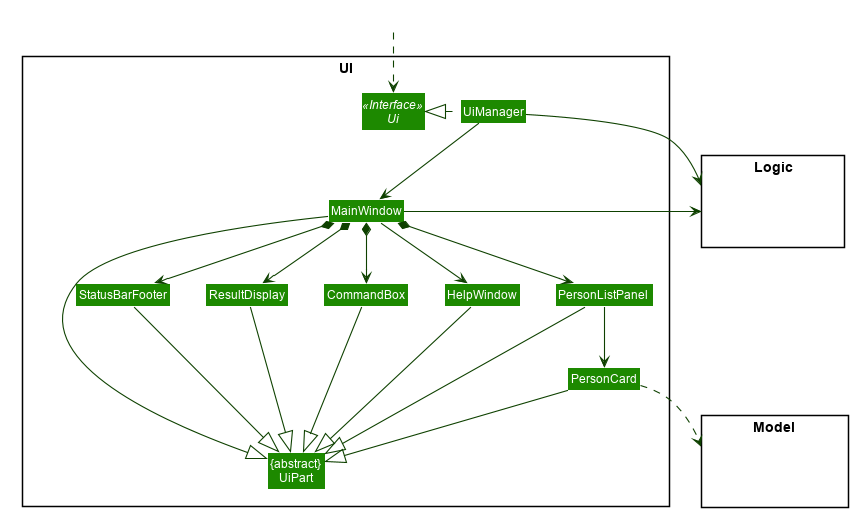
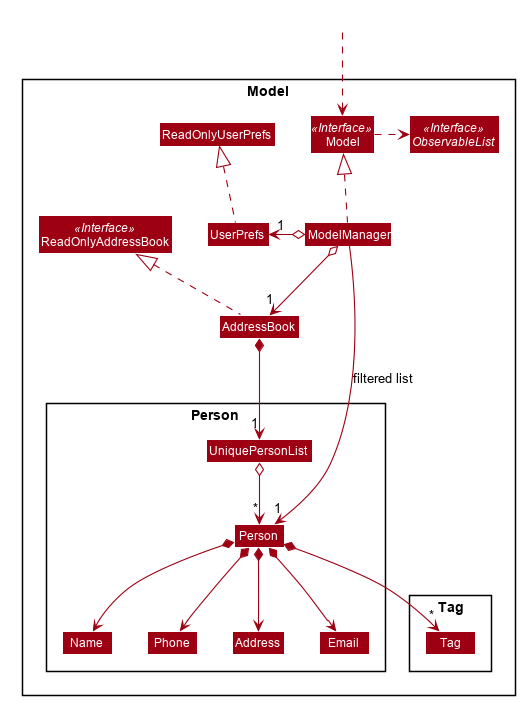
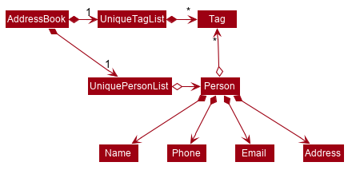

Green Tea Developer Guide (v1.2)
---------------------------------------------------------

### Table of Contents

------------------------------------------------------------------------------
## 1. Introduction

### 1.1 Purpose
This document details the architecture, design decisions and implementations for the flashcard application, Green Tea.

### 1.2 Audience
The intended audience of this document is the developers and testers of Green Tea.

-------------------------------------------------------------------
### 1.3 Glossary

|        |      |
|--------|------|
|Deck    | A collection of entries   |
|Entry   | A word and its translation|

--------------------------------------------------------------------------------------------------------------------

## 2. **Setting up, getting started**

Refer to the guide [_Setting up and getting started_](SettingUp.md).

--------------------------------------------------------------------------------------------------------------------
## 3. **Design**

This section details the various components of the application. It will cover the internal structure of each component 
and how the components will work together with one another.

### 3.1 Component Overview

The components of the app are Main, Commons, UI, Logic, Model and Storage.

Figure 1.Overview of components and their relationships 

The ***Component Overview Diagram*** above shows the high-level design of the App. Given below is a quick overview of each component.

**`Main`** has two classes called [`Main`](https://github.com/AY2021S1-CS2103T-T09-4/tp/blob/master/src/main/java/seedu/address/Main.java) and [`MainApp`](https://github.com/AY2021S1-CS2103T-T09-4/tp/blob/master/src/main/java/seedu/address/MainApp.java). They are responsible for:
* At app launch: Initialize the components in the correct sequence and connect them up with each other.
* At shut down: Shut down the components and invoke cleanup methods where necessary.

[**`Commons`**](#common-classes) represents a collection of classes used by multiple other components.

The rest of the App consists of four components:

* [**`UI`**](#ui-component): The UI of the App.
* [**`Logic`**](#logic-component): Executes commands given by the user
* [**`Model`**](#model-component): Holds the data of the App in memory.
* [**`Storage`**](#storage-component): Reads data from, and writes data to, the hard disk.

For each of the four components above:

* Defines its *API* in an `interface` with the same name as the Component.
* Exposes its functionality using a concrete `{Component Name}Manager` class (which implements the corresponding API `interface` mentioned in the previous point).

For example, the `Logic` component (see the class diagram given below) defines its API in the `Logic.java` interface and exposes its functionality using the `LogicManager.java` class which implements the `Logic` interface.

#### **How the components interact with one another**

The *Sequence Diagram* below shows how the components interact with each other for the scenario where the user issues the command `remove 1`.

 Figure 3. Components interacting with one another

The sections below give more details of each component.

### 3.2 Common classes

Common classes are classes used by multiple components. Common classes include:

* `Index`: Represents a zero or one based index. Using `Index` removes the need for a component to know what base other 
components are using for their index. Can be converted to an integer (int).
* `Messages`: Stores messages to be displayed to the user.
* `GuiSettings`: Contains the GUI settings.
* `LogsCenter`: Writes messages to the console and a log file. Records the state of the program as the app is running 

### 3.3 UI component

 Figure 4. UI component class relationship diagram 

**API** : [`Ui.java`](https://github.com/AY2021S1-CS2103T-T09-4/tp/blob/master/src/main/java/seedu/address/ui/Ui.java)

The UI consists of a `MainWindow` that is made up of parts (`CommandBox`, `ResultDisplay`, `PersonListPanel`, `StatusBarFooter`).
All these, including the `MainWindow`, inherit from the abstract `UiPart` class.

The `UI` component uses JavaFx UI framework. The layout of these UI parts are defined in matching `.fxml` files that are in the `src/main/resources/view` folder.
For example, the layout of the [`MainWindow`](https://github.com/se-edu/addressbook-level3/tree/master/src/main/java/seedu/address/ui/MainWindow.java) is specified in [`MainWindow.fxml`](https://github.com/se-edu/addressbook-level3/tree/master/src/main/resources/view/MainWindow.fxml)

The `UI` component:

* Executes user commands using the `Logic` component.
* Listens for changes to `Model` data so that the UI can be updated with the modified data.

MainWindow.fxml - Houses the rest of the fxml (commandBox,HelpWindow, etc) in the VBox
                - also contains the code for the actual menu bar

CommandBox.fxml - Stackpane where the user writes input

EntryListPanel.fxml -  Houses a ListView<Entry>

EntryListCard.fxml- (not housed by Mainwindow.fxml) contains the data from each entry

HelpWindow.fxml - Only displays label and copy url button

ResultDisplay.fxml - Prints results to user 

StatusBarFooter - returns the path of the file retrieved

### 3.4 Logic component

**API** :
[`Logic.java`](https://github.com/AY2021S1-CS2103T-T09-4/tp/blob/master/src/main/java/seedu/address/logic/Logic.java)

1. `Logic` uses the `AddressBookParser` class to parse the user command.
1. This results in a `Command` object which is executed by the `LogicManager`.
1. The command execution can affect the `Model` (e.g. adding a person).
1. The result of the command execution is encapsulated as a `CommandResult` object which is passed back to the `Ui`.
1. In addition, the `CommandResult` object can also instruct the `Ui` to perform certain actions, such as displaying help to the user.

Given below is the Sequence Diagram for interactions within the `Logic` component for the `execute("delete 1")` API call.

:information_source: **Note:** The lifeline for `DeleteCommandParser` should end at the destroy marker (X) but due to a limitation of PlantUML, the lifeline reaches the end of diagram.

### 3.5 Model component

**API** : [`Model.java`](https://github.com/se-edu/addressbook-level3/tree/master/src/main/java/seedu/address/model/Model.java)

The `Model`,

* stores a `UserPref` object that represents the user’s preferences.
* stores the address book data.
* exposes an unmodifiable `ObservableList<Person>` that can be 'observed' e.g. the UI can be bound to this list so that the UI automatically updates when the data in the list change.
* does not depend on any of the other three components.

:information_source: **Note:** An alternative (arguably, a more OOP) model is given below. It has a `Tag` list in the `AddressBook`, which `Person` references. This allows `AddressBook` to only require one `Tag` object per unique `Tag`, instead of each `Person` needing their own `Tag` object. 

### 3.6 Storage component

**API** : [`Storage.java`](https://github.com/se-edu/addressbook-level3/tree/master/src/main/java/seedu/address/storage/Storage.java)

The `Storage` component,
* can save `UserPref` objects in json format and read it back.
* can save the address book data in json format and read it back.

--------------------------------------------------------------------------------------------------------------------

## 4. **Implementation**

This section describes some noteworthy details on how certain features are implemented.

### 4.1 Deck System

This feature would allow the user to create multiple lists of entries rather than having 
all entries together in the same list. The user could have different decks
for different languages or even multiple decks for the same languages. 

E.g. 
* Deck 1: Japanese
* Deck 2: Spanish_Food
* Deck 3: Spanish_Animals

#### Design consideration:
##### Aspect: Reason behind a deck system?

* Alternative 1 (current choice):

### Select Deck

### \[Proposed\] Flashcard System

The flashcard system would allow the user to choose to practice in whichever deck
he wishes.

The methodology behind GreenTea's flashcard system will be based on the Leitner System (https://en.wikipedia.org/wiki/Leitner_system)
The Letiner system is a proven quizzing system that increases the user's rate of learning by 
using spaced repetition. In the Leitner system, flashcards are sorted based on the user's ability to answer them. Correctly 
answered flashcards are put at the end of the question queue and incorrectly answered 
flashcards are placed at the front. 

_{Feature will be added in v1.3}_

### \[Proposed\] Data Analysis
Some of the proposed parameters tracked by GreenTea include:
* Number of correctly answered flashcards
* Previous scores
* Average time taken in total
* Time of quiz

From these data, GreenTea would be able to derive some meaningful analytics to 
display to the user. These include:
* Progression since last attempt
* Length of time between quizzes
* Most forgotten phrase/translation
* Language mastery
* Progress in each deck

_{Feature will be added in v1.3}_

--------------------------------------------------------------------------------------------------------------------

## **Documentation, logging, testing, configuration, dev-ops**

* [Documentation guide](Documentation.md)
* [Testing guide](Testing.md)
* [Logging guide](Logging.md)
* [Configuration guide](Configuration.md)
* [DevOps guide](DevOps.md)

--------------------------------------------------------------------------------------------------------------------

## **Appendix: Requirements**

### Product scope

**Target user profile**:

* has a need to learn and practice a language
* wants to remember the meaning and spelling of words in a new language
* prefers question based testing to learn a language
* prefer desktop apps over other types
* can type fast
* prefers typing to mouse interactions
* is reasonably comfortable using CLI apps

**Value proposition**: helps to learn a language better through better modes of practice

### User stories

Priorities: High (must have) - `* * *`, Medium (nice to have) - `* *`, Low (unlikely to have) - `*`

| Priority | As a …​                                    | I want to …​                                | So that I can…​                                                        |
| -------- | ------------------------------------------ | ------------------------------------------- | ---------------------------------------------------------------------- |
| `* * *`  | new user                                   | see usage instructions                      | refer to instructions when I forget how to use the App                 |
| `* * *`  | user                                       | add a Word-Meaning pair                     | populate the list with words and their meanings                        |
| `* * *`  | user                                       | delete a Word-Meaning pair                  | delete an unwanted entry                                               |
| `* * *`  | user                                       | edit a Word-Meaning pair                    | edit an entry                                                          |
| `* *`    | user                                       | assign a Difficulty Ranking to words        | determine which words are more difficult for me                        |
| `* * *`  | user                                       | access a Dictionary of Word-Meaning pairs   | refresh my understanding of the words                                  |
| `* * *`  | user                                       | search the dictionary with a word           | find out its meaning                                                   |
| `* * *`  | user                                       | search the dictionary with a meaning        | find out the word                                                      |
| `* *`    | user                                       | sort the Dictionary by difficulty           | view the more difficult words in the dictionary                        |
| `* * *`  | user                                       | create a question                           | test my understanding of a word                                        |
| `* * *`  | user                                       | create a multiple choice question           | choose the correct answer                                              |
| `* * *`  | user                                       | create an open-ended question               | test my spelling and understanding of the word                         |
| `* * *`  | user                                       | delete a question                           | delete an unwanted entry                                               |
| `* * *`  | user                                       | edit a question                             | delete an unwanted entry                                               |
| `* * *`  | user                                       | access the list of questions                | view all the questions                                                 |
| `*`      | user                                       | tag a question with a difficulty rating     | create a quiz based on difficulty rating                               |
| `* * *`  | user                                       | create a quiz from the pool of questions    | attempt the questions                                                  |
| `* * *`  | user                                       | submit the quiz                             | see my results                                                         |
| `* *`    | user                                       | have a timer                                | find out how long I took to complete the quiz                          |
| `* *`    | user                                       | view statistics of the quiz                 | gauge my strengths and weaknesses                                      |
| `* *`    | user                                       | have a Rating System based on quiz results  | know my progress so far in learning the language                       |
| `* *`    | user                                       | view all the quiz scores                    | know how I performed for each quiz                                     |
| `* *`    | user                                       | go back one question in the quiz            | review the question                                                    |
| `* *`    | user                                       | skip a question in the quiz                 | skip a question and come back later                                    |
| `* *`    | user                                       | have a reminder of any incomplete questions | know if my quiz is complete                                            |
| `*`      | user                                       | view hints for the quiz                     | have help when I am stuck on a difficult question                      |
| `*`      | user                                       | test my spelling                            | learn how to spell the words correctly                                 |
| `*`      | user                                       | test a sentence structure                   | learn the grammar of the language                                      |
| `*`      | user                                       | have a reminder to practice everyday        | continue my progress consistently                                      |
*{More to be added}*

### Use cases

(For all use cases below, the **System** is `GreenTea` and the **Actor** is the `user`, unless specified otherwise)

**Use case: View help**

**MSS**

1.  User requests help
2.  GreenTea returns a message explaining how to access the help page
    Use case ends.

**Use case: Add a new entry**

**MSS**

1.  User requests to add a new entry
2.  GreenTea add the new entry

    Use case ends.

**Extensions**

* 1a. The entry is invalid

    * 1a1. GreenTea shows an error message

  Use case ends.

* 1b. The entry is valid.

  Use case resumes at step 2.

**Use case: List all entries**

**MSS**

1.  User requests to see the list of entries
2.  GreenTea shows a list of entries

    Use case ends.

**Use case: Edit an entry**

**MSS**

1.  User requests to edit an entry with updated fields via the given index
2.  GreenTea updates entry with new fields

    Use case ends.

**Extensions**

* 1a. User fed an invalid index

    * 1a1. GreenTea returns an error message

  Use case ends.

**Use case: Delete an entry**

**MSS**

1.  User requests to list entries
2.  GreenTea shows a list of entries
3.  User requests to delete a specific entry in the list via the given index
4.  GreenTea deletes the person

    Use case ends.

**Extensions**

* 2a. The list is empty.

  Use case ends.

* 3a. The given index is invalid.

    * 3a1. GreenTea shows an error message.

      Use case resumes at step 2.

**Use case: Clear a person**

**MSS**

1.  User requests to clear entries
2.  GreenTea clears all entries

    Use case ends.

**Use case: Exit **

**MSS**

1.  User requests to exit program
2.  GreenTea exits

    Use case ends.

*{More to be added}*

### Non-Functional Requirements

1.  Should work on any _mainstream OS_ as long as it has Java `11` or above installed.
2.  Should be able to hold up to 1000 persons without a noticeable sluggishness in performance for typical usage.
3.  A user with above average typing speed for regular English text (i.e. not code, not system admin commands) should be able to accomplish most of the tasks faster using commands than using the mouse.
4.  Should be easy for new users to understand, use and navigate the UI
5.  Any interface between a user and the system should have a maximum response time of 2 seconds
6.  Any reused code should be acknowledged in the README

*{More to be added}*

### Glossary

* **Mainstream OS**: Windows, Linux, Unix, OS-X
* **Private contact detail**: A contact detail that is not meant to be shared with others

--------------------------------------------------------------------------------------------------------------------

## **Appendix: Instructions for manual testing**

Given below are instructions to test the app manually.

:information_source: **Note:** These instructions only provide a starting point for testers to work on;
testers are expected to do more *exploratory* testing.

### Launch and shutdown

1. Initial launch

   1. Download the jar file and copy into an empty folder

   1. Double-click the jar file Expected: Shows the GUI with a set of sample contacts. The window size may not be optimum.

1. Saving window preferences

   1. Resize the window to an optimum size. Move the window to a different location. Close the window.

   1. Re-launch the app by double-clicking the jar file. 
       Expected: The most recent window size and location is retained.

1. _{ more test cases …​ }_

### Deleting a person

1. Deleting a person while all persons are being shown

   1. Prerequisites: List all persons using the `list` command. Multiple persons in the list.

   1. Test case: `delete 1` 
      Expected: First contact is deleted from the list. Details of the deleted contact shown in the status message. Timestamp in the status bar is updated.

   1. Test case: `delete 0` 
      Expected: No person is deleted. Error details shown in the status message. Status bar remains the same.

   1. Other incorrect delete commands to try: `delete`, `delete x`, `...` (where x is larger than the list size) 
      Expected: Similar to previous.

1. _{ more test cases …​ }_

### Saving data

1. Dealing with missing/corrupted data files

   1. _{explain how to simulate a missing/corrupted file, and the expected behavior}_

1. _{ more test cases …​ }_
